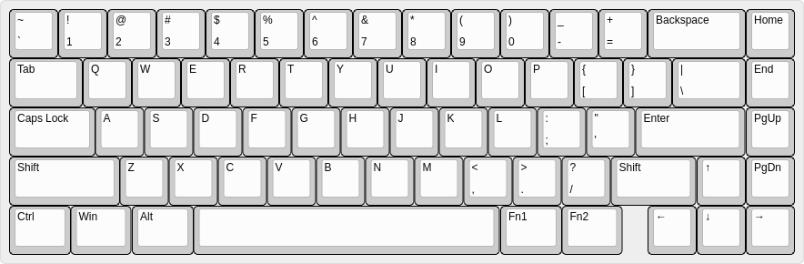
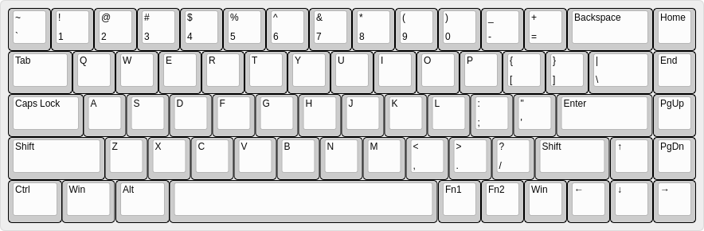

# r68 std #

This a 68% board, like a tada or sabre.

This supports two layouts:

[Compat](https://goo.gl/bRej9A): This format requires a 1.75u right shift, but retains 1.25u FN keys ([json data](compat.json))

[Narrow](https://goo.gl/9U5wPm): This keeps more meta keys to the right of the space bar, but requires 1u FN keys ([json data](narrow.json))

## Hardware Revisions/Errata ##

* 1.0: Initial version (bad right arrow, not recommended) [gerbers](https://storage.googleapis.com/rpedde-public-gerbers/r68-r1.0.zip)
* 1.1: Fix right arrow, change (ground short on C14) [gerbers](https://storage.googleapis.com/rpedde-public-gerbers/r68-r1.1.zip)
* 1.2: Repour ground (ordered from easyeda, verified working) [gerbers](https://storage.googleapis.com/rpedde-public-gerbers/r68-r1.2.zip)

## License ##

This work is Copyright 2017 Ron Pedde and distributed under the term of the GNU General Public License (version 2 or later).
